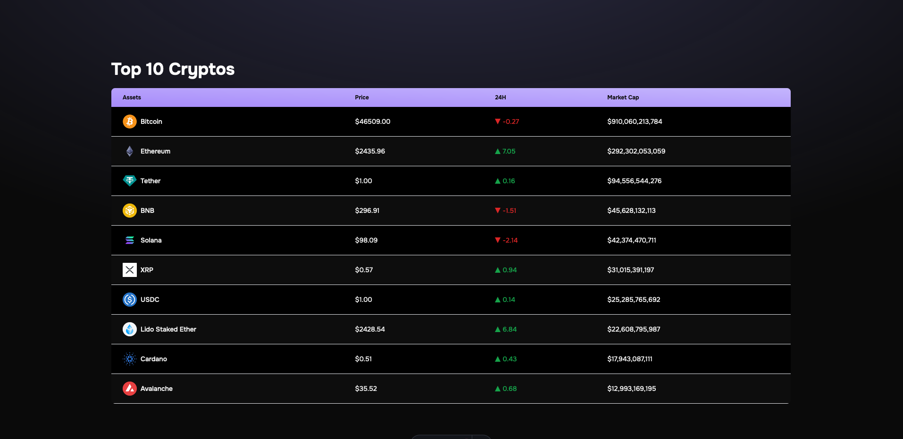

# HolaJuniors - Visualización en Tiempo Real de Criptomonedas

Desafío de programación de [HolaJuniors](https://holajuniors.com).

Nuestros desafíos te ayudan a mejorar tus habilidades de programación mediante la creación de proyectos realistas.

## Requerimientos del proyecto: [Visualización en Tiempo Real de Criptomonedas](https://holajuniors.com/challenges/visualizacion-en-tiempo-real-de-criptomonedas)

## Stack utilizado

Astro - Tailwind

## API utilizada

[Coin Gecko](https://api.coingecko.com/api/v3/coins/markets?vs_currency=usd&per_page=10)

## Demo

[Live Demo](https://top-cryptos.vercel.app/)

## Screenshots y vista previa

